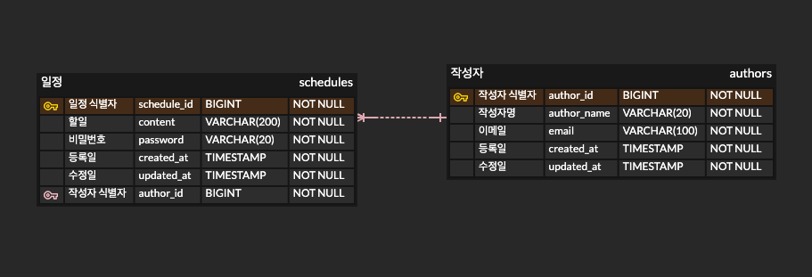

# 일정 관리 앱 API 
## 프로젝트 개요
Java + JDBC 기반 3계층 구조의 간단한 일정 관리 API 입니다.  
일정의 CRUD와 예외처리, 페이징·검색을 지원합니다.

## 주요 기능
- 일정 생성
- 일정 전체 조회 (페이징)
- 일정 조회
- 일정 수정
- 일정 삭제

## ERD

## API 명세서
더 자세한 명세는 [Notion 문서](https://vagabond-snake-4bf.notion.site/API-1ecd3128995c80a899d4cb80381ce3a3?pvs=4)를 참고해주세요.  

| 구분 | 기능            | Method | URI                             |
| ---- | --------------- | ------ | ------------------------------- |
| 일정 | 일정 조회       | GET    | /schedules/{scheduleId}         |
| 일정 | 일정 전체 조회  | GET    | /schedules                      |
| 일정 | 일정 생성       | POST   | /schedules                      |
| 일정 | 일정 수정       | PATCH  | /schedules/{scheduleId}         |
| 일정 | 일정 삭제       | DELETE | /schedules/{scheduleId}         |

